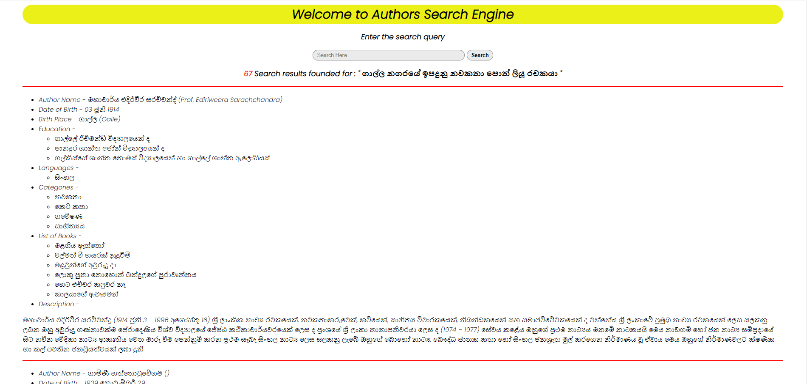
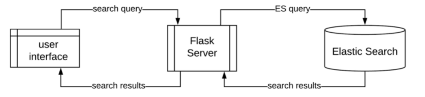
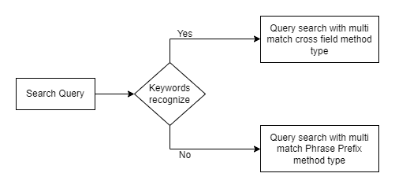

# Information Retrieval Project- Authors_Search_Engine
Authors Search Engine using ElasticSearch and Python

## Getting Start
### Environment settting up Instructions
* Download and Install the _ElasticSearch_
* Install the _ICU_Tokenizer_ plugin on the ElasticSearch
* Install the _python3_ with _pip3_
* Install the python packages in the _requirements.txt_ by _pip install -r requirements.txt_

### Search Engine running Instructions
1. First start the ElasticSearch locally on port 9200.
2. Then run **_index_creation.py_** file to create the index and insert data.
3. Next run the **_main.py_** to start the search engine
4. Then visit http://localhost:5000/ for see the user interface.
5. Finally add your search query in the search box for searching.

## Project Structure
* data - this folder contain authors datasheet and its json file, and python files of data cleaning
* templates - which includes HTML file of user interface
* documents - Folder contains project proposal & project report
* images - Folder contains diagrams used in README.md
* indexGeneration.py - Python file for index creating and data inserting
* main.py - main python file which handles API request of queries
* queryRequestJsonCreation.py - Elastic Search queries
* requirements.txt - txt file which has python dependancies 
* searchCreation.py - Python file which process search request data

## Authors Data
cleaned_authors.json file contains 103 Authors details with the following data.
1. name - Author name in Sinhala
2. name_english -  Author name in English
3. date_of_birth - date of birth of Author
4. birth_place - Birth place of Author in Sinhala
5. birth_place_english - Birth place of Author in English
6. education - Educated places of Author
7. languages - Lanugages is used to write 
8. categories - areas covered by writing
9. list_of_books - books of Author
10. description - Brief description of Author

## Basic Functionalities
* search query can be includes in any fields out of author_name, author_name_english, date_of_birth, birth_place, birth_place_english, languages, education, categories, list_of_books
> eg: මහාචාර්ය එදිරිවීර සරච්චන්ද්‍ර, Arthur C. Clark, සිංහල, විද්‍යාප්‍රබන්ධ, Koggala

* there are synonym keyword lists to be identified special word tokens from search query. search will be customized according to priority of each field. whereas high weights will be given for identified fields by perticular keywords
> eg: "මාර්ටින් වික්‍රමසිංහ රචකයා ගේ විස්තර" - word 'රචකයා' relates with AuthorName field. then authorName will be given high weight

* Search Engine supports bilingusl queries.
> eg: එදිරිවීර සරච්චන්ද්‍ර රචකයා, author sarachchandra, author එදිරිවීර සරච්චන්ද්‍

* Search engine supports multiple field searches in search string
> eg: "මළගිය ඇත්තෝ පොත රචනා කළ කතුවරයා" - 'පොත' relates with listOfBooks field, 'කතුවරයා' relates with AuthorName

## User Interface
* Following figure shows the example search result of the UI.

## Project Architecture
Following figure shows how the search engine works through the flask server.

<!--  -->

## Indexing & Query techniques

### Indexing
* 'ICU_Tokenizer’ which is a standard tokenizer and which has better support for sinhala language to tokenize text into the words. 
* Elastic search ‘edge_ngram’ filter was used to generate n-grams. 

### MultiSearch with Rule Base classification
* Rule-based text mining is used to understand and extract data from the user entered query string. 

* A basic set of rules are applied to each search phrase to identify the keywords, classify them into relevant search types. Acoording to the classification user query was classified to one of the following query type.

    1. Range query with Cross Fields
    2. Faceted query with Cross Fields
    3. Range query with phrase-prefix
    4. Faceted query with phrase-prefix
    
Follwing diagram further shows the use of Rule Based Classification and Multisearch queries.

<!--  -->